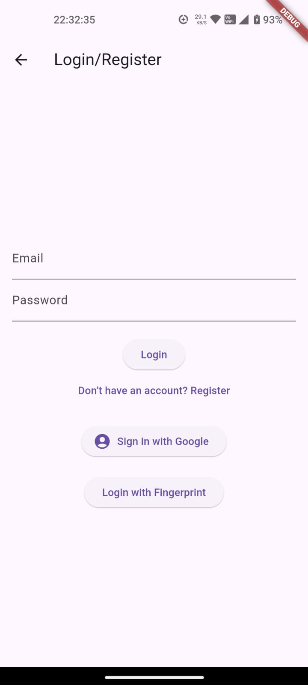
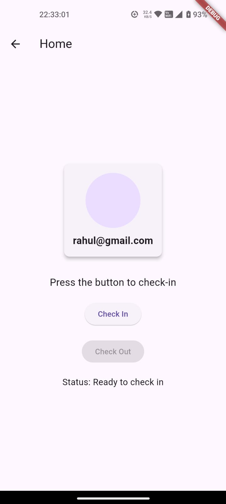
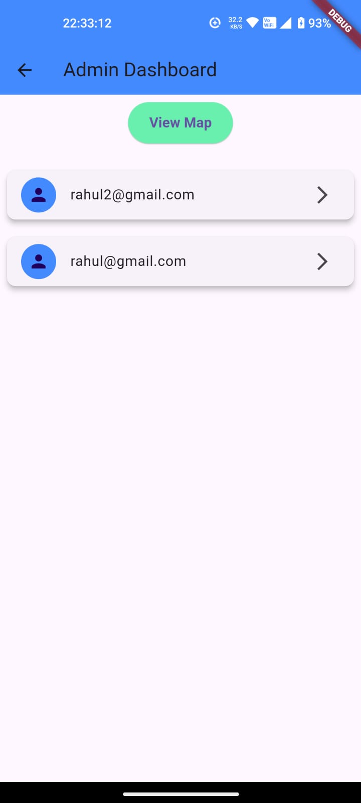
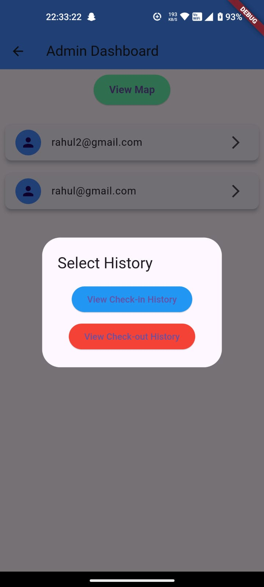
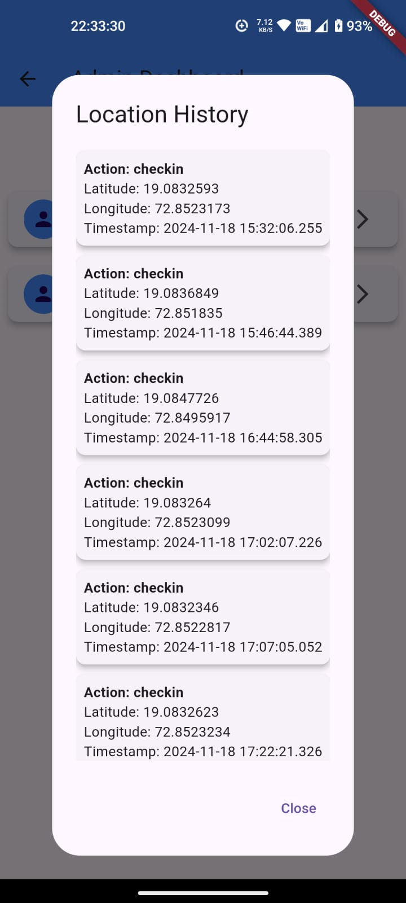
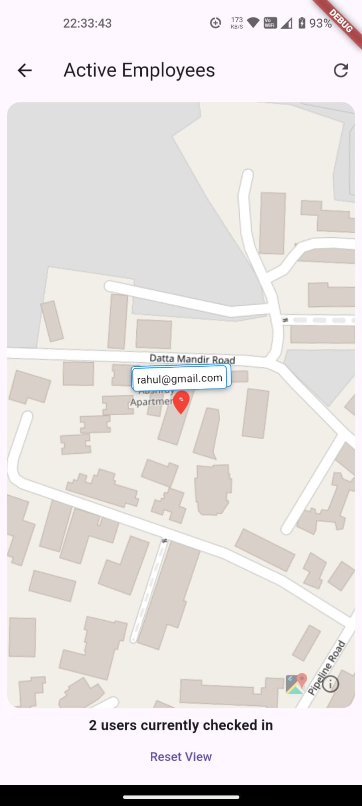
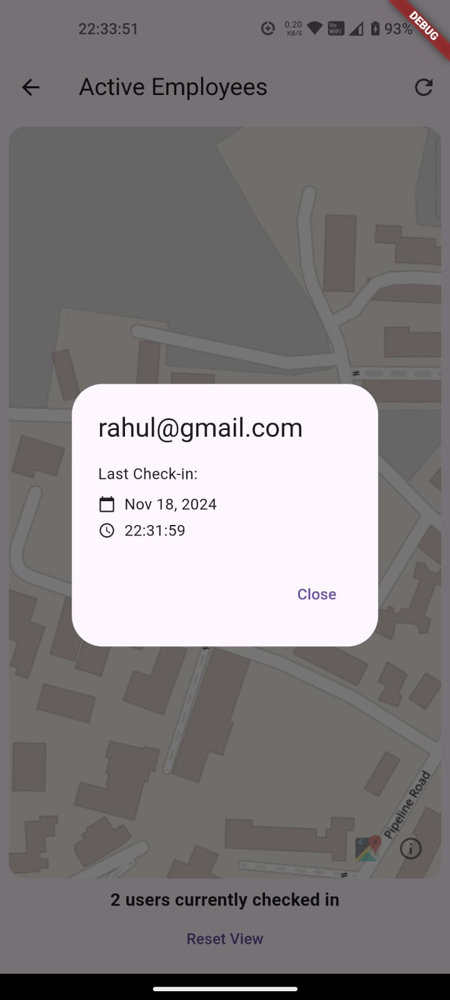

# Employee Tracking Application

This Flutter-based application helps organizations track employee check-in and check-out times using their mobile devices. It also provides admin users with a way to view check-in history, including location information, for enhanced employee management.

## Project Description

**Employees** can:
- **Check in and Check out** conveniently from their mobile app.
- Utilize **Biometric Authentication** (fingerprint or face recognition) for secure sign-in.

**Admin users** have access to:
- A comprehensive view of **employee check-in and check-out history**.
- A **map visualization** displaying the location of the last check-in for each employee.


## Application Screens

|  |  |  |  |
| -------------------------------------------------------- | -------------------------------------------------------- | ------------------------------------------------------------ | ------------------------------------------------------------ |
| **Login/Register Page**                                  | **Home Page**                                             | **Admin Home Page**                                          | **View History for Admin**                                  |

|  |  |  |  |
| ------------------------------------------------------------- | ---------------------------------------------------------- | ------------------------------------------------------------ | ------------------------------------------------------------ |
| **View History Details**                                     | **Maps for Admin**                                          | **Details on Map**                                           


### Technologies and Libraries
- **Dart:** The programming language for building the Flutter application.
- **Firebase:** Used for essential services:
  - **Cloud Firestore:** Stores employee check-in/check-out data.
  - **Authentication:** Handles user sign-in, including support for Biometric Authentication.

---

## Features
- **Secure sign-in** with **Biometric Authentication** (fingerprint or face recognition).
- **Employee check-in/check-out tracking** with timestamps.
- **Detailed check-in history view** for admin users.
- **Interactive map** for admins to visualize the location of the last check-in.


## Getting Started

To set up the project on your local machine, follow these steps:

### Prerequisites:
Ensure you have Flutter installed on your local machine. Refer to the official guide for your system:

- **Flutter Installation:** [Flutter Installation Guide](https://docs.flutter.dev/get-started/install)

### Clone the Repository:
1. Open your terminal or command prompt.
2. Clone this repository
3. Navigate to the project directory
4. Run ```flutter pub get ```


**Note:** Make sure that an emulator is running or a physical device is connected to your machine.


## Project Structure

- **lib/**: Contains the Dart source code for the Flutter application.
  - `main.dart`: The entry point of the application.
  - `home_page.dart`: The primary screen for employee check-in/check-out.
  - `monitor_location.dart`: Handles location tracking and permission requests.
  - `login_register.dart`: Manages the sign-in process using Firebase Authentication.
  - `admin_dashboard.dart`: Deals with the Admin Dashboard to view CheckIn/CheckOut Histories
  - `maps.dart`: Provides the map to view Employee Location
  - `firestore_service.dart` and `location_service.dart`: Supporting files for Handling Firebase and location communications

- **android/**: Contains Android-specific code and configuration files.
  - `AndroidManifest.xml`: Specifies Android app configuration and permissions.


## Firebase Setup

This application uses Firebase services for authentication and data storage. To set up Firebase, follow these steps:

1. **Create a Firebase project:** Visit the [Firebase Console](https://console.firebase.google.com/).
2. **Add your Android app:** Include your app (package name found in `android/app/src/main/AndroidManifest.xml`) in the Firebase project. Visit the [Adding Android App to Firebase](https://firebase.google.com/docs/android/setup?authuser=0&hl=en).
3. **Enable Firebase Authentication:** Activate Firebase Authentication for your app.
4. **Set up Firestore:** Configure Firestore to store employee check-in/check-out data.


## Final Step 

Once all the prerequisites are sorted and you have everything in order to run the project, 
do a ```flutter run```
in your console. 
